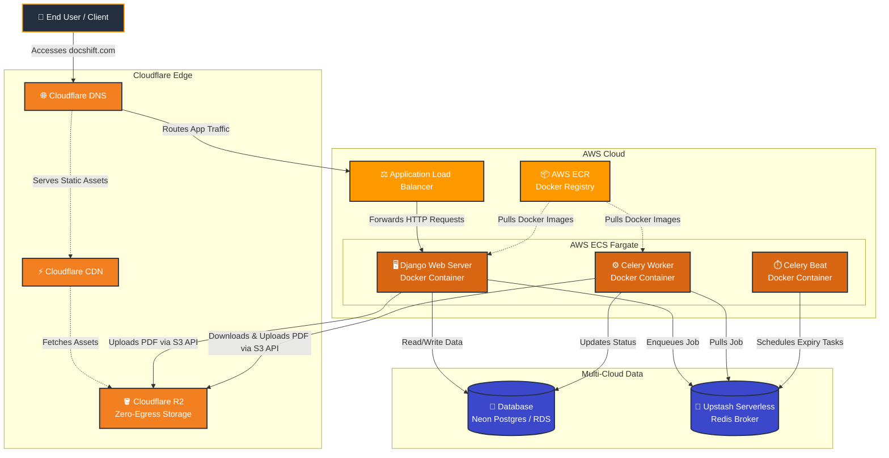

# DocShift Multi-Cloud Architecture (AWS + Cloudflare)

This diagram visualizes how DocShift utilizes AWS ECS (Fargate) for compute, Cloudflare for edge routing and zero-egress file storage, and Serverless databases.

### 🧩 Why this Architecture is Perfect

1. **Massive Cost Savings**: By keeping your storage out of AWS (Cloudflare R2) and your queue Serverless (Upstash), you avoid AWS's notorious egress fees and idle server costs.
2. **Containerized Compute (ECS Fargate)**: You aren't paying for idle EC2 servers. Fargate spins up isolated containers for your Web app and Celery workers, scaling based on PDF processing demand.
3. **Seamless Integration**: Your code talks to Cloudflare R2 exactly as if it were AWS S3. No code changes required!
4. **Global Edge Network**: Cloudflare caches your static files globally and blocks bad traffic before it reaches AWS, keeping your compute costs minimal.
