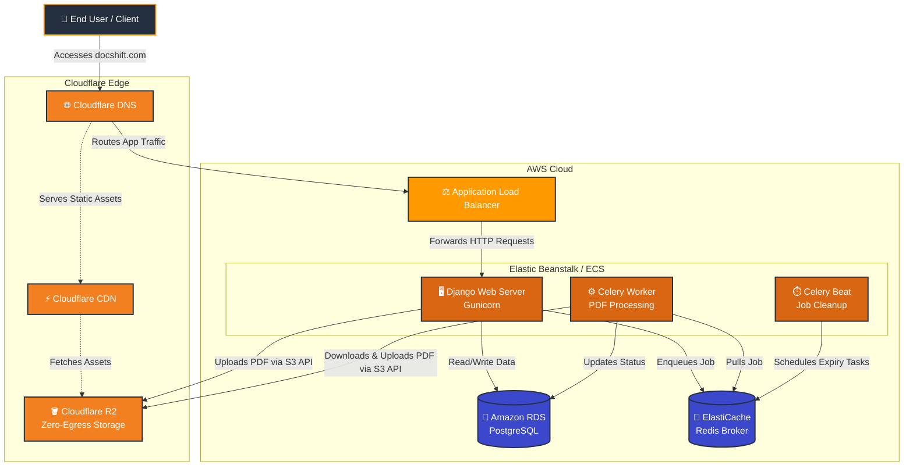

# DocShift Multi-Cloud Architecture (AWS + Cloudflare)

This diagram visualizes how DocShift utilizes AWS for compute and Cloudflare for edge routing and zero-egress file storage.

### 🧩 Why this Architecture is Perfect

1. **Massive Cost Savings**: By keeping your storage out of AWS, you avoid AWS's notorious `$0.09/GB` data transfer fees. Cloudflare R2 does not charge for egress bandwidth when users download converted PDFs.
2. **Seamless Integration**: Because your code (`settings.py`) sets `AWS_S3_REGION_NAME = 'auto'`, the `django-storages` library talks to Cloudflare R2 exactly as if it were AWS S3. No code changes required!
3. **AWS Compute Power**: You still get the reliability and auto-scaling power of AWS Elastic Beanstalk / ECS for running the CPU-heavy PDF processing tasks. 
4. **Global Edge Network**: Cloudflare caches your static files globally, taking the load off your web server.
