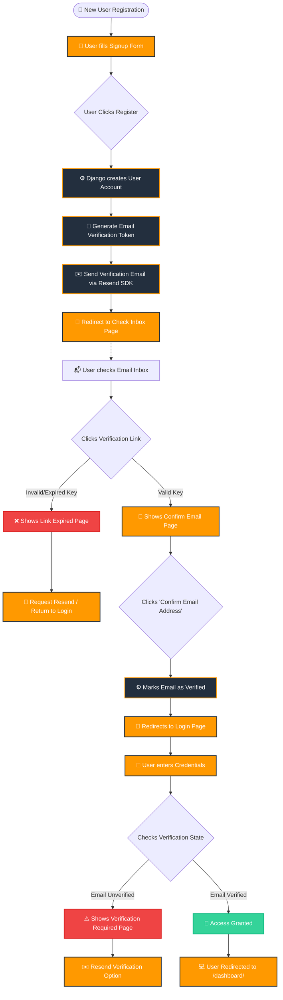

# DocShift Manual Registration & Email Verification Flow

This flowchart describes the step-by-step user signup, email verification, and login process in DocShift, using **Django-Allauth** and the custom **Resend Email Backend**.

### 🛠️ What We Did & Core Components

We configured a complete, secure manual login and email verification flow:

1. **Mandatory Verification Settings** ([settings.py](file:///c:/Users/maury/OneDrive/Desktop/docshift/final_version_live/docshift/docshift/settings.py)):
   - Configured `ACCOUNT_EMAIL_VERIFICATION = 'mandatory'` to ensure users cannot access the dashboard or premium tools until they confirm their email.
   - Configured `SOCIALACCOUNT_EMAIL_REQUIRED = True` to guarantee that social signups (Google, GitHub) always retrieve verified emails.

2. **Custom Resend Email Backend** ([email_backend.py](file:///c:/Users/maury/OneDrive/Desktop/docshift/final_version_live/docshift/converter/email_backend.py)):
   - Created `ResendEmailBackend` to hook into Django's mailing engine.
   - Reads `RESEND_API_KEY` to send rich, multi-part HTML verification emails using the official **Resend Python SDK**.

3. **Premium User Interface Templates** ([templates/account/](file:///c:/Users/maury/OneDrive/Desktop/docshift/final_version_live/docshift/templates/account/)):
   - Created and customized the registration templates to match the sleek dark-mode design system:
     - `email_verification_sent.html`: Beautiful envelope illustration instructing the user to check their email.
     - `email_confirm.html`: Interactive page asking the user to confirm their email address or warning them if their link is expired.
     - `verified_email_required.html`: Restricts access if the user attempts to log in before verifying, offering an option to resend the verification email.
