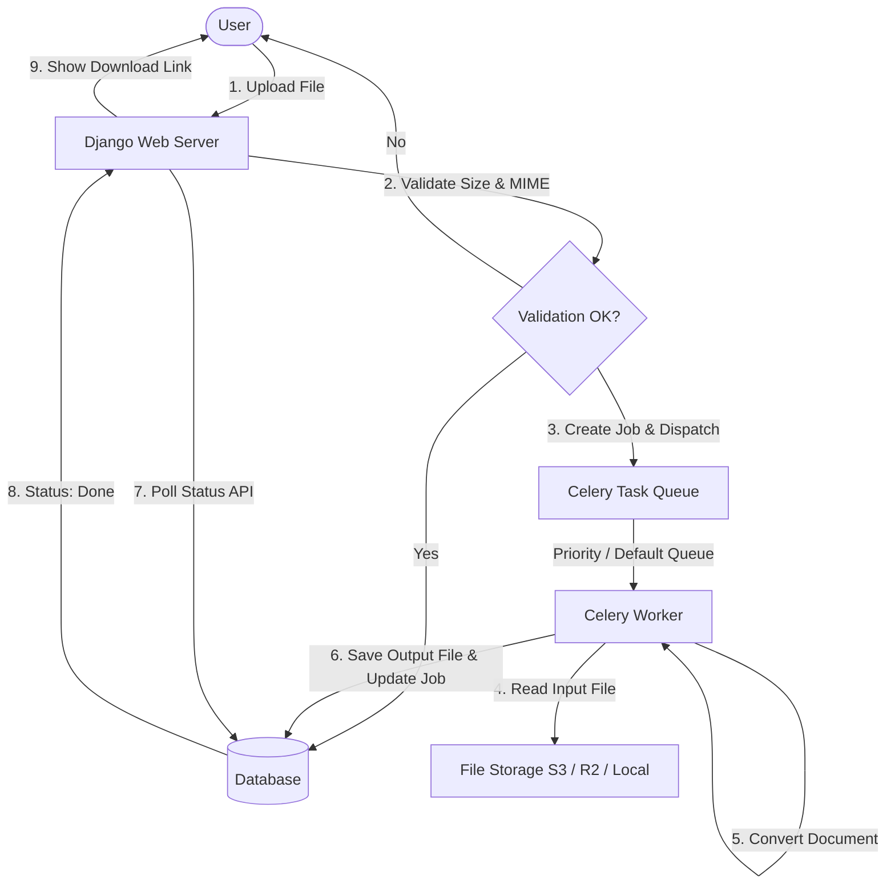

# Phase 0: PDF, Word, and PPT Conversion

This document details the architecture, workflows, codeflow, and code reviews for the core file conversion services (Phase 0).

## 1. Workflow Diagram (Mermaid)



---

## 2. Architecture Level
DocShift follows an asynchronous task processing architecture to convert documents without blocking the main web request thread.
* **Web Server Layer:** Django handles incoming file uploads, requests validation, creates `ConversionJob` records, and dispatches tasks.
* **Asynchronous Task Queue:** Celery acts as the task executor with Redis as the message broker.
* **Priority Routing:** Jobs are routed to queues based on plan tiers:
  - `priority` queue for **Corporate** subscribers.
  - `default` queue for **Free** and **Developer** subscribers.
* **Conversion Engines:** 
  - **PyMuPDF (`fitz`):** Handles PDF compression, splitting, merging, rotating, watermarking, password protection, and text extraction.
  - **reportlab:** Generates PDFs from DOCX, TXT, and Images.
  - **python-docx:** Parses Microsoft Word files.
  - **Pillow (`PIL`):** Resizes images and converts formats (PNG/JPG).
* **Storage Layer:** Uses `django-storages` mapping to Cloudflare R2 / AWS S3 via boto3 (with secure 1-hour pre-signed URLs) or falls back to local FileSystem storage during development.

---

## 3. Code Level (Functionality & Snippets)

### A. Job Dispatches & Priority Queue Routing
When a file is uploaded, the server validates the file type/size and creates a database model. It routes Corporate plan users to a priority queue to ensure fast conversions under load.

**Code Snippet (`converter/views.py`):**
```python
def _dispatch_task(tool_slug, job, extra_kwargs=None):
    tasks = _get_tasks()
    task_map = {
        'compress_pdf':     tasks.compress_pdf_task,
        'merge_pdf':        tasks.merge_pdfs_task,
        # ... other tasks
    }
    fn = task_map.get(tool_slug)
    if not fn: return
    kwargs = {'job_id': str(job.id)}
    if extra_kwargs:
        kwargs.update(extra_kwargs)

    # Route Corporate jobs to priority queue, others to default
    queue_name = 'default'
    if job.user:
        try:
            if job.user.api_profile.plan_tier == 'Corporate':
                queue_name = 'priority'
        except Exception:
            pass

    try:
        fn.apply_async(kwargs=kwargs, queue=queue_name)
    except Exception as e:
        job.refresh_from_db()
        job.status = 'failed'
        job.error_message = f'Service unavailable: {str(e)}.'
        job.save(update_fields=['status', 'error_message'])
```

### B. DOCX to PDF Conversion Tasks
Word-to-PDF conversion processes the paragraphs of a Word document, checks for headings or body styles, sanitizes text strings, and builds a PDF using Reportlab styles.

**Code Snippet (`converter/tasks.py`):**
```python
@shared_task(bind=True)
def docx_to_pdf_task(self, job_id):
    from converter.models import ConversionJob
    from converter.utils import get_output_path
    job = ConversionJob.objects.get(id=job_id)
    try:
        job.status = 'processing'; job.save()
        from docx import Document
        from reportlab.lib.pagesizes import A4
        from reportlab.lib.styles import getSampleStyleSheet, ParagraphStyle
        from reportlab.lib.units import inch
        from reportlab.platypus import SimpleDocTemplate, Paragraph, Spacer

        abs_path, rel_path = get_output_path(job.input_file.name, '.pdf')
        doc_word = Document(job.input_file.path)
        pdf_doc = SimpleDocTemplate(abs_path, pagesize=A4)
        
        styles = getSampleStyleSheet()
        normal = ParagraphStyle('N', parent=styles['Normal'], fontSize=11, leading=16, spaceAfter=8)
        h1 = ParagraphStyle('H1', parent=styles['Heading1'], fontSize=15, leading=22, spaceAfter=12)

        story = []
        for para in doc_word.paragraphs:
            raw = para.text
            if not raw or not raw.strip():
                story.append(Spacer(1, 0.12 * inch)); continue
            text = raw.replace('&', '&amp;').replace('<', '&lt;').replace('>', '&gt;')
            sname = para.style.name if para.style else ''
            if 'Heading' in sname or 'Title' in sname:
                story.append(Paragraph(text, h1))
            else:
                story.append(Paragraph(text, normal))
                
        pdf_doc.build(story)
        job.output_file = rel_path
        job.status = 'done'; job.save()
    except Exception as e:
        job.status = 'failed'; job.error_message = str(e); job.save()
        raise
```

---

## 4. User Level
1. **Selection:** User lands on the DocShift dashboard or home index page.
2. **Configuration:** User clicks on a tool (e.g., *Compress PDF*), selects a local file, sets custom options (e.g., Extreme/Recommended compression levels), and clicks "Upload & Process".
3. **Progress Page:** User is redirected to `/job/<uuid>/status/`. The page polls `/job/<uuid>/status/json/` using AJAX every 2 seconds. The client displays a progress spinner.
4. **Completion:** Upon successful completion, the spinner is replaced by a "Download File" and "Preview" buttons. If the conversion fails, it shows the error message with a "Retry" button.

---

## 5. Vulnerability and DRY Principle Review

### ⚠️ Critical DRY Violation: Duplicate View Definition
The `dashboard_delete_job` view is defined twice consecutively in `converter/views.py`:
- **First definition:** Lines 657–678.
- **Second definition:** Lines 680–701.
* **Impact:** High redundancy, which can lead to bugs if future code modifications update one version but leave the other active.
* **Action:** Delete the duplicate definition (lines 680–701) to restore clean, single-point maintenance.

### 🧹 Best Practice Recommendation: Temporary Directory Leaks
Inside `split_pdf_task` and `pdf_to_images_task`, temporary directories are created using `tempfile.mkdtemp()`. If an exception occurs, files are deleted individually, but the temporary folder is never removed.
* **Impact:** Disk bloat over time as orphan directories gather in `/tmp`.
* **Action:** Wrap temporary file generation inside Python's context manager:
  ```python
  with tempfile.TemporaryDirectory() as tmp_dir:
      # Perform splitting or image generation inside this block
      # Files and directories are guaranteed to be cleaned up upon exit.
  ```
