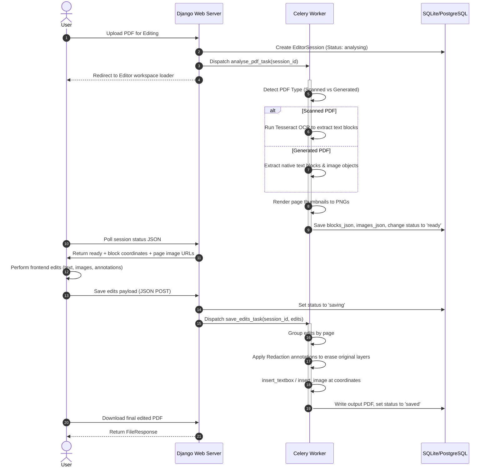

# Phase 1: PDF Editor

This document details the architecture, workflows, codeflow, and code reviews for the online PDF Editor (Phase 1).

## 1. Workflow Diagram (Mermaid)



---

## 2. Architecture Level
The PDF Editor is an in-browser document manipulation tool built on top of layout coordinates.
* **Layout Extraction (Analysis):** Before the user starts editing, DocShift converts the PDF pages into high-resolution PNG background images. Simultaneously, it extracts text layout blocks (bounding boxes `x, y, w, h`, text string, font size, and font name).
* **OCR Support:** Scanned documents are passed page-by-page to **Tesseract OCR** using `pytesseract` to overlay invisible selection areas corresponding to scanned text.
* **Redaction-based Replacement:** To "edit" text, the editor uses PyMuPDF's redaction API. Rather than trying to change text stream streams directly (which breaks fonts and alignments), the system applies a white redaction box to wipe out the old text, flattens the page, and then draws the replacement text precisely on top at the same coordinates.

---

## 3. Code Level (Functionality & Snippets)

### A. PDF Type Detection and Layout Extraction
The analysis task categorizes pages to extract structured text.

**Code Snippet (`editor/tasks.py`):**
```python
@shared_task(bind=True)
def analyse_pdf_task(self, session_id):
    from editor.models import EditorSession
    from editor.utils import (detect_pdf_type, extract_text_blocks, extract_images,
                              render_page_images, run_ocr_on_page, page_dimensions)
    session = EditorSession.objects.get(id=session_id)
    try:
        import fitz
        session.status = 'analysing'; session.save()
        doc = fitz.open(session.original_file.path)
        pdf_type = detect_pdf_type(doc)
        session.pdf_type = pdf_type
        session.page_count = len(doc)
        
        all_blocks = []
        if pdf_type in ('generated', 'mixed'):
            all_blocks.extend(extract_text_blocks(doc))
        if pdf_type in ('scanned', 'mixed'):
            for page in doc:
                # Fallback to OCR if no native text layers are found
                all_blocks.extend(run_ocr_on_page(page, dpi=150))
                
        images = extract_images(doc)
        render_page_images(doc, str(session.id), dpi=150)
        dims = page_dimensions(doc)
        doc.close()
        
        session.blocks_json = [{"type": "meta", "page_dimensions": dims}] + all_blocks
        session.images_json = images
        session.status = 'ready'
        session.save()
    except Exception as e:
        session.status = 'failed'; session.error_message = str(e); session.save()
```

### B. Applying Redactions and Font Insertion Resizing
To save edits, PyMuPDF wipes the selected coordinates. If the text is too long for the bounding box, it automatically scales down the font size.

**Code Snippet (`editor/tasks.py`):**
```python
# Pass 1 — redact original text areas
for edit in page_edits:
    x, y, w, h = _f(edit.get('x')), _f(edit.get('y')), _f(edit.get('w')), _f(edit.get('h'))
    redact_rect = fitz.Rect(max(0, x - 1), max(0, y - 1), x + w + 1, y + h + 1)
    page.add_redact_annot(redact_rect, fill=(1, 1, 1))
page.apply_redactions()

# Pass 2 — insert replacement text
for edit in page_edits:
    new_text = str(edit.get('new_text') or '').strip()
    if not new_text: continue
    
    x, y, w, orig_h = _f(edit.get('x')), _f(edit.get('y')), _f(edit.get('w')), _f(edit.get('h'))
    font_size = max(6.0, _f(edit.get('font_size', 12.0)))
    font_name = _safe_font(str(edit.get('font_name')))
    
    # Calculate box height adjustments
    line_height = font_size * 1.5
    chars_per_line = max(1, int(w / (font_size * 0.55)))
    num_lines = max(1, -(-len(new_text) // chars_per_line))
    needed_h = num_lines * line_height + 4
    
    insert_rect = fitz.Rect(x, y, x + w, min(page_rect.height, y + max(orig_h, needed_h)))
    rc = page.insert_textbox(insert_rect, new_text, fontsize=font_size, fontname=font_name)
    
    # Check for overflow and scale down
    if rc < 0:
        small_size = max(6.0, font_size * 0.75)
        page.insert_textbox(insert_rect, new_text, fontsize=small_size, fontname=font_name)
```

---

## 4. User Level
1. **Upload:** User drops a PDF into the editor drag-drop zone.
2. **Workspace:** Once loaded, pages are rendered as images with interactive input boxes over text blocks.
3. **Modification:** User clicks on any text block, modifying it via an inline edit dialog (changing text, size, color, or alignment).
4. **Drawing/Markups:** User adds custom highlighting boxes or creates brand new textboxes anywhere on the layout.
5. **Download:** User clicks "Download PDF". The edited changes are permanently embedded into the PDF structure.

---

## 5. Vulnerability and DRY Principle Review

### 🚫 Denial of Service (DoS) Risk on Large Scanned Documents
* **Issue:** Guest (anonymous) users can upload large scanned PDFs (e.g. 100 pages) and run OCR. OCR uses Tesseract, which utilizes 100% of a CPU core to process page images. Under moderate usage, this quickly exhausts Celery worker pools.
* **Remedy:** Restrict OCR page counts and document size specifically for guests. Limit guests to documents under 5 pages for OCR, prompting them to create a free account to lift the limit.

### 🧩 Hardcoded Paths in settings.py
* **Issue:** `TESSERACT_CMD` uses a fallback hardcoded path for Windows.
* **Remedy:** Ensure proper fallback variables and throw a warning on server start if `tesseract` is missing from the environment.
