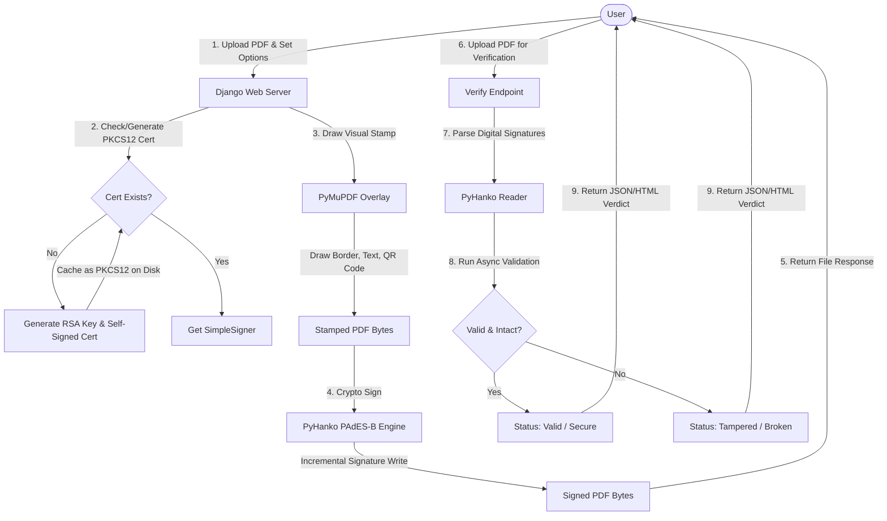

# Phase 2: Digital Signatures and Verification

This document details the architecture, workflows, codeflow, and code reviews for the Digital Signature and Verification services (Phase 2).

## 1. Workflow Diagram (Mermaid)



---

## 2. Architecture Level
DocShift uses cryptographic PDF signing compliant with PAdES-B Level 2.
* **PKCS#12 Archive:** The platform handles signatures using an RSA-2048 private key and X.509 certificate bundled into a `.p12` PKCS#12 package. If no cert exists, the application generates a self-signed root certificate valid for 10 years, cached in `media/.signing_certs/`.
* **Visual Signature Stamps:** A signature stamp is drawn directly onto the PDF stream before cryptographic signing. PyMuPDF (`fitz`) draws borders, text, and generates a dynamic QR code pointing to the validation portal.
* **Cryptographic Signer:** The stamped PDF bytes are signed using `pyhanko`'s `IncrementalPdfFileWriter` to append signature dictionaries and hashes without corrupting PDF page structures.
* **Verification Engine:** Users upload signed PDFs. The system inspects signature dictionaries, validates cryptographic hashes, and uses async validations to verify if the file has been modified or tampered with since the signature was applied.

---

## 3. Code Level (Functionality & Snippets)

### A. Drawing Visual Stamp and Digital Signing
To ensure the signature cannot be removed or altered, the visible stamp is permanently written into the PDF canvas stream before the cryptographic hash is computed.

**Code Snippet (`converter/signing.py`):**
```python
def sign_pdf(input_bytes, signer_name="ShiftDocs User", reason="Document Signing",
             visual_signature=True, position="bottom_right", page_choice="last",
             stamp_style="card", offset=10):
    
    # 1. Draw visual signature stamp onto the raw PDF byte stream
    if visual_signature:
        input_bytes = _draw_visible_stamp(
            input_bytes, 
            signer_name=signer_name, 
            reason=reason, 
            position=position, 
            page_choice=page_choice,
            stamp_style=stamp_style,
            offset=offset
        )

    # 2. Get SimpleSigner loaded from PKCS12 certificate
    signer = _get_signer()
    writer = IncrementalPdfFileWriter(io.BytesIO(input_bytes))

    sig_meta = PdfSignatureMetadata(
        field_name='ShiftDocs_Signature',
        reason=reason,
        name=signer_name,
        location='ShiftDocs Platform',
    )

    output = io.BytesIO()
    
    # 3. Perform cryptographic PAdES-B signature
    pyhanko_sign_pdf(
        writer,
        sig_meta,
        signer=signer,
        output=output,
    )

    return output.getvalue()
```

### B. Dynamic Certificate Creation
If the server is freshly deployed, it auto-provisions a self-signed root certificate.

**Code Snippet (`converter/signing.py`):**
```python
def _ensure_pkcs12():
    cert_dir = _get_cert_dir()
    p12_path = cert_dir / 'shiftdocs_sign.p12'
    if p12_path.exists():
        return str(p12_path)

    # Generate RSA 2048 key
    key = rsa.generate_private_key(public_exponent=65537, key_size=2048)

    # Build self-signed cert valid for 10 years
    subject = issuer = x509.Name([
        x509.NameAttribute(NameOID.COUNTRY_NAME, "IN"),
        x509.NameAttribute(NameOID.ORGANIZATION_NAME, "ShiftDocs"),
        x509.NameAttribute(NameOID.COMMON_NAME, "ShiftDocs Document Signing CA"),
    ])
    now = datetime.datetime.utcnow()
    cert = (
        x509.CertificateBuilder()
        .subject_name(subject)
        .issuer_name(issuer)
        .public_key(key.public_key())
        .serial_number(x509.random_serial_number())
        .not_valid_before(now)
        .not_valid_after(now + datetime.timedelta(days=3650))
        .add_extension(x509.BasicConstraints(ca=True, path_length=None), critical=True)
        .sign(key, hashes.SHA256())
    )

    # Serialize to PKCS#12 (unencrypted for dev simplicity)
    p12_data = serialization.pkcs12.serialize_key_and_certificates(
        name=b"ShiftDocs Signing",
        key=key,
        cert=cert,
        cas=None,
        encryption_algorithm=serialization.NoEncryption(),
    )
    p12_path.write_bytes(p12_data)
    return str(p12_path)
```

---

## 4. User Level
1. **Selection:** User navigates to `/digital-sign/`.
2. **Parameters:** User selects a PDF, chooses their signature name (defaults to full name if logged in), selects stamp style (Text-only, Card with QR, or QR-only), position, and page choice.
3. **Execution:** User clicks "Sign PDF". The signed PDF is generated and downloaded instantly.
4. **Verification:** User uploads any PDF in the verification portal. They receive a green status card for valid/unmodified signatures, or a red alert warning showing tampering/modification after signing.

---

## 5. Vulnerability and DRY Principle Review

### 🔑 Private Key Security Vulnerability
* **Issue:** The PKCS#12 `.p12` file (which contains both the certificate and the private RSA signing key) is saved to disk using `serialization.NoEncryption()`. If an attacker gains directory traversal access to the media folder, they can steal the file and forge digital signatures as ShiftDocs.
* **Remedy:** Encrypt the PKCS#12 file using a strong password loaded from the `.env` configuration file:
  ```python
  password = os.environ.get('SIGNING_CERT_PASSWORD', 'default_secure_pass').encode()
  p12_data = serialization.pkcs12.serialize_key_and_certificates(
      name=b"ShiftDocs Signing",
      key=key,
      cert=cert,
      cas=None,
      encryption_algorithm=serialization.BestAvailableEncryption(password),
  )
  ```

### 🧵 Event Loop Leaks in verify_pdf
* **Issue:** In `verify_pdf`, `asyncio.new_event_loop()` is spawned inside a synchronous request thread. If many users access the verify endpoint simultaneously, this can cause thread context-switching overhead and memory leaks.
* **Remedy:** Use a helper function to safely run coroutines inside existing loops or utilize fallback wrappers.
