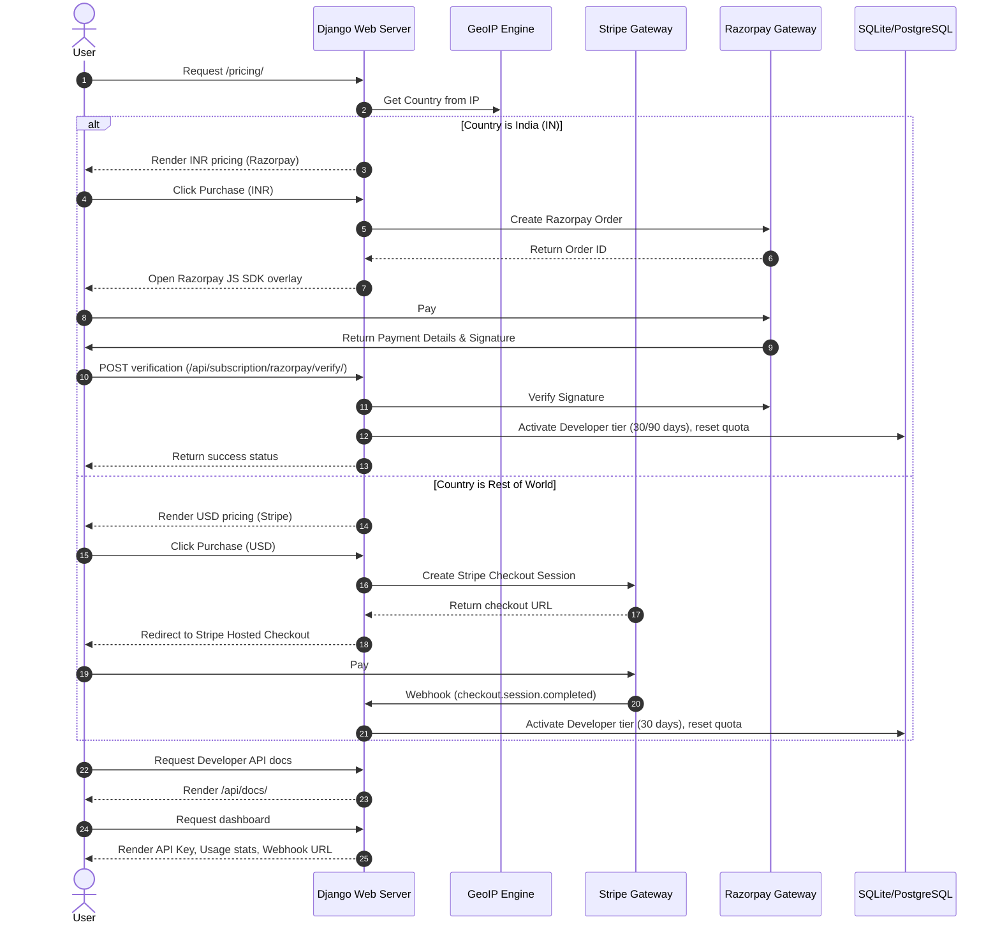

# Phase 3: Pricing Page, API page, Terms page, with Pricing Logic

This document details the pricing logic, multi-gateway subscriptions, developer API endpoint, and webhook workflows (Phase 3).

## 1. Workflow Diagram (Mermaid)



---

## 2. Architecture Level
DocShift pricing and billing architecture uses regional gateways depending on user geolocation.
* **GeoIP Parsing:** During pricing requests, a custom lookup (`converter/geoip.py`) detects country parameters.
  - **India (IN):** Defaults to **Razorpay** checkout in INR.
  - **International:** Defaults to **Stripe** checkout in USD.
* **Double webhook listeners:** Django exposes separate endpoints to listen to Stripe and Razorpay events. These endpoints run asynchronously and handle billing changes:
  - **Stripe Webhook:** Upgrades user profile tiers upon `checkout.session.completed`.
  - **Razorpay Webhook:** Upgrades user profile tiers upon `order.paid` (acts as fallback if synchronous signature verification fails).
* **API Management:** Authorized users get access to the `/api/v1/convert/<slug>/` endpoints. Request rate limiting is enforced via `@rate_limit_api` matching settings limits.

---

## 3. Code Level (Functionality & Snippets)

### A. Geolocation-based Price Selection
The pricing view uses geo-lookup to choose currency, amounts, and payment channels.

**Code Snippet (`converter/views.py`):**
```python
def pricing_view(request):
    from .geoip import get_user_country
    country = get_user_country(request)
    price_30_days = getattr(settings, 'RAZORPAY_PLAN_PRICE_30_DAYS_INR', 799)
    price_90_days = getattr(settings, 'RAZORPAY_PLAN_PRICE_90_DAYS_INR', 1499)
    
    if country == 'IN':
        currency = 'INR'
        symbol = '₹'
        price = f"{price_90_days:,}"
        gateway = 'razorpay'
    else:
        currency = 'USD'
        symbol = '$'
        price = '19'
        gateway = 'stripe'
        
    return render(request, 'converter/pricing.html', {
        'price_30_days': price_30_days,
        'price_90_days': price_90_days,
        'country': country,
        'currency': currency,
        'symbol': symbol,
        'price': price,
        'gateway': gateway,
    })
```

### B. Stripe Webhook Provisioning
Stripe sends asynchronous payloads to confirm checkout sessions. The view validates signatures and updates the user's plan.

**Code Snippet (`api/views.py`):**
```python
@csrf_exempt
def stripe_webhook(request):
    payload = request.body
    sig_header = request.META.get('HTTP_STRIPE_SIGNATURE')
    endpoint_secret = getattr(settings, 'STRIPE_WEBHOOK_SECRET', 'whsec_placeholder')

    try:
        event = stripe.Webhook.construct_event(payload, sig_header, endpoint_secret)
    except (ValueError, stripe.error.SignatureVerificationError):
        return HttpResponse(status=400)

    if event['type'] == 'checkout.session.completed':
        session = event['data']['object']
        user_id = session.get('metadata', {}).get('user_id')
        if user_id:
            try:
                user = User.objects.get(id=user_id)
                profile = user.api_profile
                profile.plan_tier = 'Developer'
                profile.stripe_customer_id = session.get('customer')
                profile.stripe_subscription_id = session.get('subscription')
                profile.plan_start_date = timezone.now()
                profile.plan_expiry_date = timezone.now() + timedelta(days=30)
                profile.last_quota_reset = timezone.now()
                profile.save()

                send_plan_confirmation_email(user, 'Developer', plan_expiry_date=profile.plan_expiry_date)
            except User.DoesNotExist:
                pass

    return HttpResponse(status=200)
```

---

## 4. User Level
1. **Purchase:** User goes to pricing, clicks "Buy Developer Plan", completes payment.
2. **Key Access:** After redirect, the user visits the dashboard to retrieve their auto-generated API Key.
3. **Integration:** User configures their optional Webhook URL on the dashboard.
4. **Execution:** User signs API requests using the `Authorization: Bearer <API_KEY>` header. When the job finishes, DocShift triggers a POST webhook callback to the user's listener with output links.

---

## 5. Vulnerability and DRY Principle Review

### 🔒 Simulation Mode Security Hole
* **Issue:** In development, Stripe and Razorpay default to placeholder secrets (`sk_test_placeholder`, `rzp_test_placeholder`). In production settings, missing credentials block Stripe but could lead to silent failures or mock-purchases if webhooks are hit directly without signature verification.
* **Remedy:** Enforce a strict environment check. In production (`DEBUG=False`), raise a critical error during initialization if payment keys are set to placeholder values.

### 🛑 Broad Exception Catching in Razorpay Webhooks
* **Issue:** The webhook catches all verification errors inside a blank `except Exception:` block, returning `status=400`. This hides validation details, making misconfigurations hard to audit.
* **Remedy:** Catch specific signature errors (`razorpay.errors.SignatureVerificationError`) and log warnings using Python's `logging` system.
