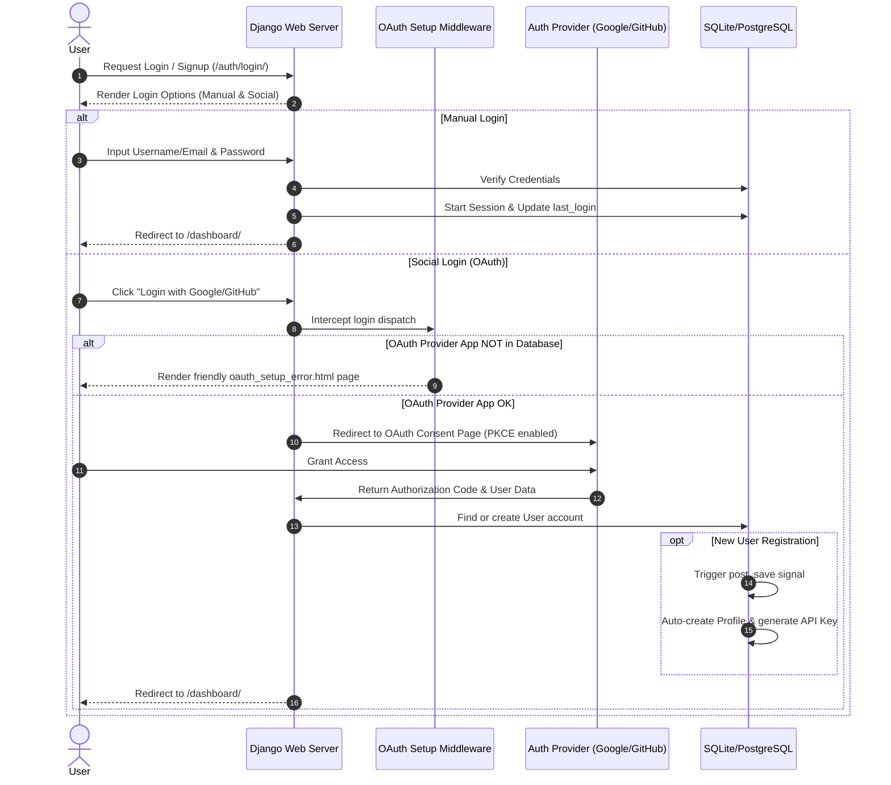

# Phase 4: Login and Signup with Social Login

This document details the user authentication workflows, social login integrations, custom middleware, and registration lifecycle (Phase 4).

## 1. Workflow Diagram (Mermaid)



---

## 2. Architecture Level
DocShift handles authentication using **`django-allauth`**, a standard registration library for Django.
* **Manual Registration:** Handled via username, email, and password. Setup enforces mandatory email verification (`ACCOUNT_EMAIL_VERIFICATION = 'mandatory'`).
* **Social OAuth Integration:** Users can authenticate via Google or GitHub. Configurations are defined under `SOCIALACCOUNT_PROVIDERS` in `settings.py`.
* **OAuth Setup Middleware:** In development, developers often forget to add `SocialApp` configurations to Django's administration database. A custom `OAuthSetupMiddleware` intercepts Django's database exceptions on auth login endpoints and serves a clean instruction page rather than a server error.
* **Auto-Profile Generation:** Registration is hooked to Django's `post_save` signals on the `User` model. When any new user registers (either manually or via OAuth), a corresponding API `Profile` is automatically created, generating their unique developer API keys.

---

## 3. Code Level (Functionality & Snippets)

### A. OAuth App Error Interception
The custom middleware intercepts missing database entities for OAuth providers.

**Code Snippet (`converter/middleware.py`):**
```python
class OAuthSetupMiddleware:
    """
    Catch allauth DoesNotExist errors (unconfigured OAuth apps)
    and show a friendly setup page instead of a 500 error.
    """
    def __init__(self, get_response):
        self.get_response = get_response

    def __call__(self, request):
        response = self.get_response(request)
        return response

    def process_exception(self, request, exception):
        path = request.path
        # Only intercept on /auth/<provider>/login/ paths
        if '/auth/' in path and '/login/' in path:
            from django.core.exceptions import ObjectDoesNotExist
            if isinstance(exception, ObjectDoesNotExist):
                provider = 'google' if 'google' in path else 'github' if 'github' in path else 'unknown'
                return render(request, 'oauth_setup_error.html', {
                    'provider': provider,
                    'provider_title': provider.title(),
                }, status=200)
        return None
```

### B. Django Profile Signals
New users are assigned an API profile automatically.

**Code Snippet (`api/models.py`):**
```python
# Auto-create Profiles for new users
@receiver(post_save, sender=User)
def create_user_profile(sender, instance, created, **kwargs):
    if created:
        Profile.objects.create(user=instance)

@receiver(post_save, sender=User)
def save_user_profile(sender, instance, **kwargs):
    try:
        instance.api_profile.save()
    except Profile.DoesNotExist:
        Profile.objects.create(user=instance)
```

---

## 4. User Level
1. **Selection:** User visits `/auth/login/` or `/auth/signup/`.
2. **Method:** User inputs username + password or clicks "Login with Google" / "Login with GitHub".
3. **Redirection:** OAuth users accept permissions on provider pages.
4. **Welcome:** User lands on `/dashboard/` with their account active. A free tier plan profile is configured with 0 quota by default.

---

## 5. Vulnerability and DRY Principle Review

### 🕵️ Account Enumeration Vulnerability
* **Issue:** `ACCOUNT_PREVENT_ENUMERATION = False` is set in `settings.py`. This lets an attacker query the sign-up or password-reset forms to check if a specific email exists on the platform by looking at form validation responses (e.g. "An account with this email already exists" vs. "Email address sent").
* **Remedy:** Set `ACCOUNT_PREVENT_ENUMERATION = True` in `settings.py`. This standardizes responses (e.g., always saying "A link has been sent if the email exists") to protect user privacy.

### 🛡️ Social Auto-Signup Verification Bypass
* **Issue:** `SOCIALACCOUNT_AUTO_SIGNUP = True` enables immediate user login upon OAuth verification. If the social account provider does not verify emails (some self-hosted OAuth providers or accounts do not), users could register with spoofed emails.
* **Remedy:** Confirm the `socialaccount` providers return verified emails and enforce check validations prior to saving user profiles.
