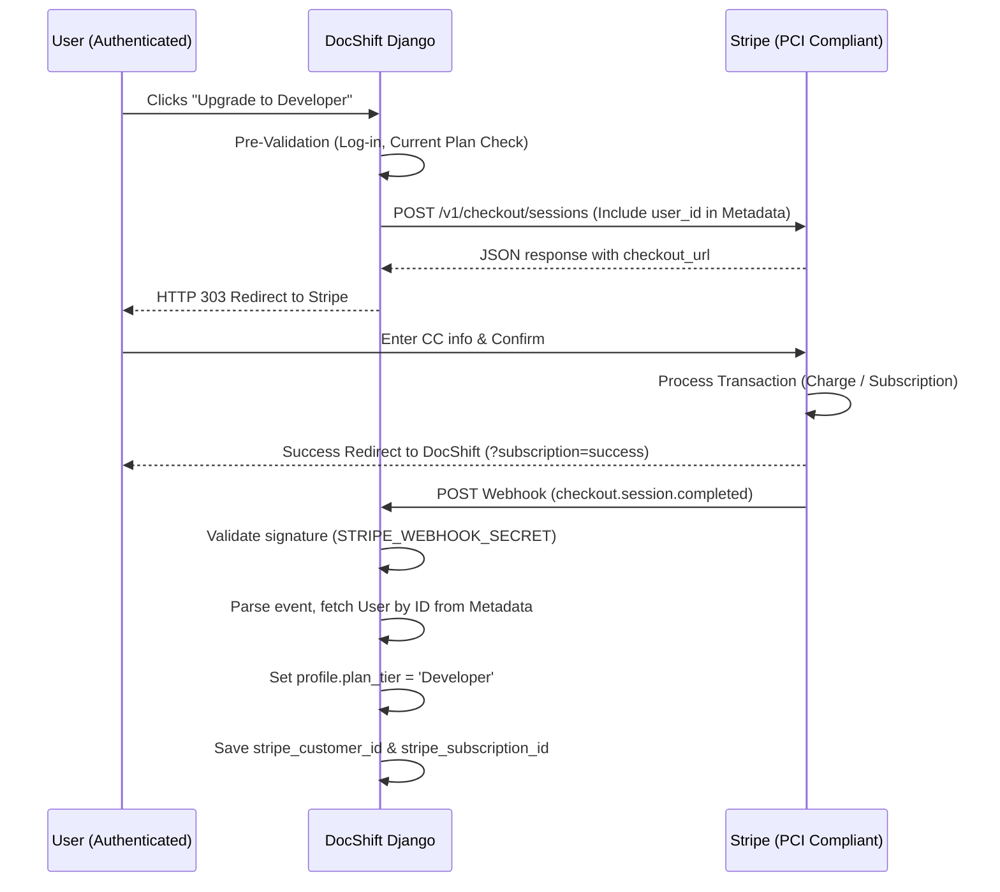
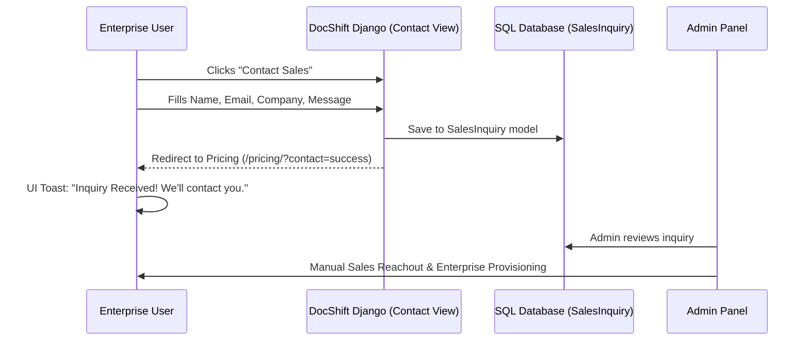

# DocShift Subscription & Payment Flow (Stripe)

This document details the technical implementation of the DocShift subscription system, covering both the automated **Developer** tier and the managed **Corporate** sales process.

## 1. Developer Plan: Automated Checkout

The Developer plan is built on **Stripe Checkout**, ensuring that users are never asked for sensitive card data on DocShift servers directly.

### A. Sequence Diagram

### B. Implementation Details
- **Session Metadata**: We pass the `user_id` in the `metadata` field of the Stripe Session. This allows the webhook to identify the user even if the browser session is closed.
- **Webhook Security**: All webhook requests are strictly verified using the `STRIPE_WEBHOOK_SECRET` and the `HTTP_STRIPE_SIGNATURE` header.
- **Dynamic Pricing**: For the MVP, we use dynamic price creation ($19.00 USD / Month) rather than hardcoded Price IDs, allowing for easier initial deployment.

---

## 2. Corporate Plan: Lead Generation

The Corporate plan uses a high-touch sales model. Interest is captured via a contact form and stored for manual review by the sales team.

### A. Sequence Diagram

### B. "Premium Feedback" Logic
To ensure a high-quality experience without complex state management, we use **URL Query Parameters**:
1.  Upon a successful POST request in `converter/views.py`, we redirect the user to `/pricing/?contact=success`.
2.  A small JavaScript listener in **[pricing.html](file:///c:/Users/maury/OneDrive/Desktop/docshift/docshift/templates/converter/pricing.html)** detects this parameter and triggers a CSS-animated banner.

---

## 3. Data Models

### Profile (`api.models.Profile`)
Extends the standard Django User to track API-specific data:
- `plan_tier`: `Free` (Default), `Developer`, or `Corporate`.
- `stripe_customer_id`: Link to the Stripe Customer object.
- `stripe_subscription_id`: Link to the active subscription for easy cancellation.

### SalesInquiry (`converter.models.SalesInquiry`)
Captures leads for the high-touch corporate flow:
- `name`, `email`, `company`, `message`.
- `processed`: Boolean to track if sales has contacted them.

---

## 4. Security Tiers

- **Hobby (Free)**: 10MB limit, no API key required for manual tool use.
- **Developer ($19)**: 50MB limit, 5,000 API calls/month, Webhook access.
- **Corporate (Custom)**: 500MB+ limit, 50,000+ API calls/month, Priority Support.
