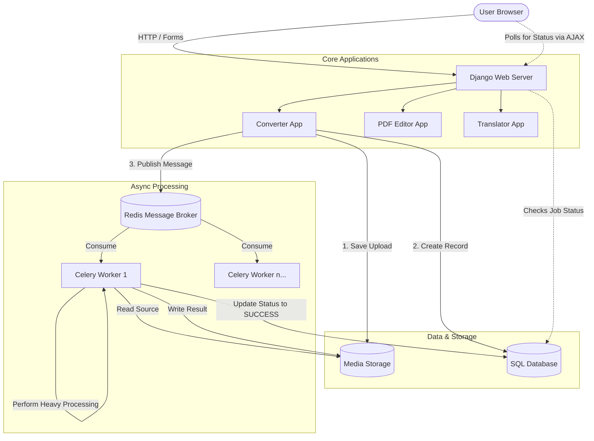

# DocShift System Architecture & Design

This document outlines the system design, data flow, and module responsibilities for the DocShift SaaS platform.

## 1. High-Level Architecture

DocShift relies on a robust, asynchronous **Django + Celery + Redis** architecture.

---

## 2. Module-Level Design

### A. The Web Server (Django)
The primary entry point. It receives HTTP requests, renders the Jinja / Tailwind CSS templates, serves the Dashboard, and handles user authentication (via Django AllAuth). It aims to respond to the user as quickly as possible (usually < 200ms).

### B. The `converter` App
The heart of DocShift. It maps dozens of tool endpoints to backend processing logic.
- **[views.py](file:///c:/Users/maury/OneDrive/Desktop/docshift/docshift/editor/views.py)**: Intercepts requests. Contains the massive `TOOL_CONFIG` dictionary which acts as a routing table. It validates files, writes them to disk, creates a [ConversionJob](file:///c:/Users/maury/OneDrive/Desktop/docshift/docshift/converter/models.py#36-161) safely in the database, and punts the actual work to Celery.
- **[forms.py](file:///c:/Users/maury/OneDrive/Desktop/docshift/docshift/converter/forms.py)**: Handles rigorous tool-specific validations (e.g., rejecting an image when a PDF is required, validating DPI numbers).
- **[utils.py](file:///c:/Users/maury/OneDrive/Desktop/docshift/docshift/editor/utils.py)**: Pure utility functions like verifying MIME types to prevent malicious uploads, and standardizing human-readable file sizes.
- **[tasks.py](file:///c:/Users/maury/OneDrive/Desktop/docshift/docshift/editor/tasks.py)**: Contains the Celery background functions (e.g., [compress_pdf_task](file:///c:/Users/maury/OneDrive/Desktop/docshift/docshift/converter/tasks.py#8-33), [merge_pdfs_task](file:///c:/Users/maury/OneDrive/Desktop/docshift/docshift/converter/tasks.py#40-78)). These functions open the file, use libraries like `PyMuPDF` or `Pillow`, perform the heavy I/O bound processing, save the result, and update the database to notify the user.

### C. The `editor` App
A specialized module that handles interactive, multi-step PDF manipulation directly in the browser via complex session management.
- **State Management**: Unlike the converter (which is upload → process → download), the editor relies on an [EditorSession](file:///c:/Users/maury/OneDrive/Desktop/docshift/docshift/editor/models.py#10-91) object.
- **Preview Generation**: Uses PyMuPDF at a low resolution to rapidly generate `.png` page previews so the user can visually sort, rotate, or delete pages in the browser in real-time.
- **Final Compilation**: Applies an array of queued frontend actions (like `[rotate 90, delete page 2, move 4 to 1]`) to a fresh copy of the master document, ensuring high quality.

### D. The Data Layer
- **Media Storage (`/media`)**: Acts as a giant scratchpad. Accepts uploads, holds them temporarily during Celery execution, and stores the final result.
- **Database (`ConversionJob`, `EditorSession`)**: Stores strictly metadata. Pointers to where the physical files live, who owns them, and what the `status` of the job is (`pending`, `processing`, `success`, `error`).

### E. The Clean-up Engine
DocShift employs a highly aggressive auto-deletion schedule to guarantee user privacy.
- Uses `django-celery-beat` (a cron-job scheduler) to wake up every 5 minutes.
- It sweeps the database looking for `ConversionJob` or `EditorSession` records older than 1 hour (for guests) or 24 hours (for registered users).
- It physically unlinks (deletes) the source and output files from the hard drive, then deletes the database row entirely.

---

## 3. Scaling the Architecture (Up to Enterprise)

To handle massive amounts of global traffic, docshift’s architecture supports immediate horizontal scaling:
1. **Storage Tier:** Swap the local `media/` directory for AWS S3. Your server's hard drive space becomes unlimited.
2. **Worker Tier:** Because Django and Celery are totally decoupled via Redis, you can deploy the Celery `tasks.py` code to 50 separate dedicated servers to crunch millions of PDFs without slowing down the website itself.
3. **Database Tier:** Upgrade the internal SQLite database to a fully managed PostgreSQL instance to support tens of thousands of concurrent reads and writes.
